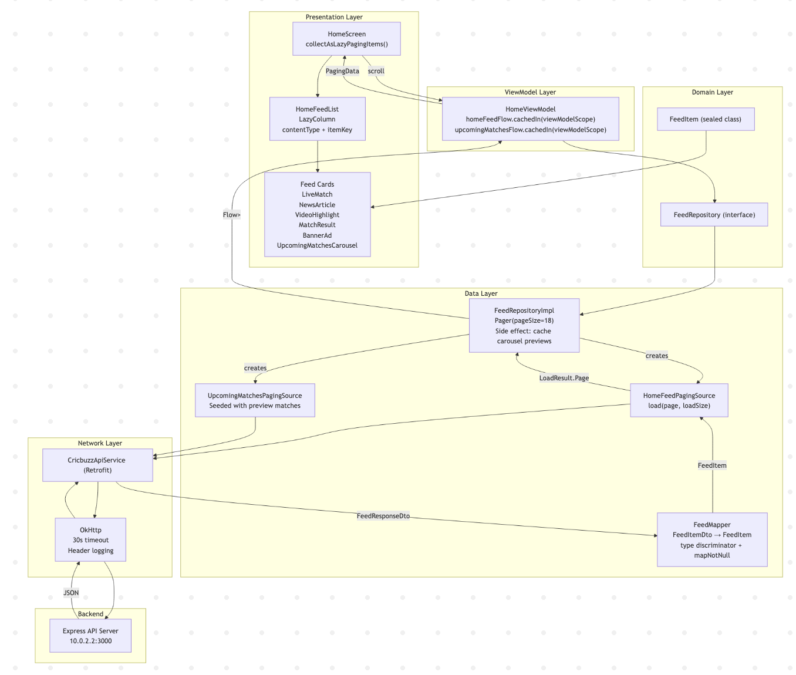

# CricFeed — Data Flow Documentation

This document traces the complete data flow through the CricFeed Android app, from the backend API call to the rendered UI.

---

## DFD Image
app/src/main/res/DFDv1.png

## Data Flow: Start to End

### Step 1 — User Scrolls (UI Trigger)

`HomeScreen` collects `homeFeedFlow` from `HomeViewModel` using `collectAsLazyPagingItems()`. As the user scrolls near the bottom, Paging3 automatically triggers a new page load.

### Step 2 — ViewModel

`HomeViewModel` holds multiple independent `Flow<PagingData<T>>` streams, each `cachedIn(viewModelScope)` to survive configuration changes:

- `homeFeedFlow` — main vertical feed (`FeedItem`)
- `upcomingMatchesFlow` — full carousel pagination (`UpcomingMatch`)
- `matchResultFlow` — match results feed (`MatchResult`)

### Step 3 — Repository

`FeedRepositoryImpl.getHomeFeed()` wraps a `Pager` with:

| Config | Value |
|--------|-------|
| `pageSize` | 18 |
| `initialLoadSize` | 18 |
| `prefetchDistance` | 1 |
| `enablePlaceholders` | false |

A **side effect** occurs here: when a `FeedItem.UpcomingMatchesCarousel` passes through, the repository caches its 5 preview matches to seed the full-screen carousel pagination later.

### Step 4 — PagingSource

`HomeFeedPagingSource.load(page, loadSize)` is called by the Paging3 library.

- Calls `CricbuzzApiService.getHomeFeed(page, loadSize)` via Retrofit
- Returns `LoadResult.Page(data, prevKey, nextKey)`
- Sets `nextKey = null` when `hasNext == false` (end of feed)

### Step 5 — Network (Retrofit + OkHttp)

An HTTP GET is made:

```
GET http://10.0.2.2:3000/api/feed/home?page=1&limit=18
```

OkHttp handles: 30s timeouts, header-level logging. Kotlinx.serialization with lenient JSON parsing deserializes the response body into `FeedResponseDto`.

### Step 6 — Deserialization (DTOs)

The raw JSON becomes typed Kotlin objects:

```
FeedResponseDto
  ├── data: List<FeedItemDto>          ← polymorphic, typed by "type" field
  │     ├── type: String               ← discriminator ("live_match", "news_article", etc.)
  │     ├── id: String
  │     ├── timestamp: Long
  │     └── data: JsonElement          ← raw JSON for the specific content type
  └── pagination: PaginationDto        ← currentPage, totalPages, hasNext, hasPrevious
```

### Step 7 — Mapping (DTO → Domain)

`FeedMapper` converts each `FeedItemDto` to a domain `FeedItem`:

1. Reads the `type` discriminator string
2. Deserializes `data: JsonElement` into the matching DTO (`LiveMatchDto`, `NewsDto`, etc.)
3. Converts the specific DTO to a domain model
4. Returns `null` for unknown types — filtered out by `mapNotNull`

This isolates the rest of the app from raw API shapes.

### Step 8 — Domain Model

`FeedItem` is a sealed class — the single type flowing through the entire presentation layer:

```kotlin
sealed class FeedItem {
    data class LiveMatch(...)                 : FeedItem()
    data class UpcomingMatchesCarousel(...)   : FeedItem()  // includes 5 preview matches + totalCount
    data class NewsArticle(...)               : FeedItem()
    data class VideoHighlight(...)            : FeedItem()
    data class MatchResult(...)               : FeedItem()
    data class BannerAd(...)                  : FeedItem()
}
```

### Step 9 — UI Rendering

`HomeFeedList` uses a `LazyColumn` with:

- **`contentType`** — tells Compose which composable to reuse per type (50–70% fewer recompositions)
- **`itemKey`** — stable identity per item, prevents layout thrashing
- **`when` dispatch** — each `FeedItem` subtype renders its own card composable

Load states are observed directly: a spinner shows while appending, an "END REACHED" label shows at end of pagination.

---

## DFD — Level 0 (Context Diagram)

```
                        ┌───────────────────────────────────┐
                        │           CricFeed App             │
   User Scroll ────────►│                                   │────────► Rendered Feed UI
                        │                                   │
   (Paging trigger)     │                                   │◄──────── API JSON Response
                        └───────────────────────────────────┘
                                        │
                                        ▼
                              Backend API Server
                           (Express @ 10.0.2.2:3000)
```

---

## DFD — Level 1 (Internal Data Flow)

```
┌────────────────────────────────────────────────────────────────────────────────┐
│                                  ANDROID APP                                   │
│                                                                                │
│   ┌────────────┐    LazyPagingItems    ┌────────────────────────────────────┐ │
│   │            │◄──────────────────── │           HomeScreen               │ │
│   │            │                      │   (collectAsLazyPagingItems)        │ │
│   │            │   scroll/page load   │   HomeFeedList LazyColumn           │ │
│   │            │──────────────────── ►│   contentType dispatch              │ │
│   │ HomeView-  │                      │   LiveMatchCard                     │ │
│   │   Model    │                      │   UpcomingMatchesCarouselComponent  │ │
│   │            │                      │   NewsArticleCard                   │ │
│   │cachedIn(   │                      │   VideoHighlightCard                │ │
│   │viewModel   │                      │   MatchResultCard                   │ │
│   │  Scope)    │                      │   BannerAdCard                      │ │
│   └──────┬─────┘                      └────────────────────────────────────┘ │
│          │                                                                     │
│          │ Flow<PagingData<FeedItem>>                                          │
│          ▼                                                                     │
│   ┌──────────────────────────────────────────────────────────────────────┐    │
│   │                       FeedRepositoryImpl                             │    │
│   │  Pager(pageSize=18) → Flow<PagingData<FeedItem>>                    │    │
│   │  Side effect: cache UpcomingMatchesCarousel.matches (5 previews)    │    │
│   └────────────────────┬─────────────────────────────────────────────────┘   │
│                         │                                                      │
│                         │ creates & calls                                      │
│                         ▼                                                      │
│   ┌──────────────────────────────────────────────────────────────────────┐    │
│   │                    HomeFeedPagingSource                              │    │
│   │  load(page, loadSize) → LoadResult.Page<Int, FeedItem>              │    │
│   │  nextKey = page+1 if hasNext, else null                             │    │
│   └────────────────────┬─────────────────────────────────────────────────┘   │
│                         │                                                      │
│                         │ calls                                                │
│                         ▼                                                      │
│   ┌──────────────────────────────────────────────────────────────────────┐    │
│   │                      CricbuzzApiService (Retrofit)                   │    │
│   │  getHomeFeed(page, limit): FeedResponseDto                          │    │
│   │  OkHttp: 30s timeout, header logging                                │    │
│   └────────────────────┬─────────────────────────────────────────────────┘   │
│                         │                                                      │
└─────────────────────────┼──────────────────────────────────────────────────────┘
                          │  HTTP GET /api/feed/home?page=1&limit=18
                          ▼
             ┌─────────────────────────┐
             │   Backend API Server    │
             │  Express @ port 3000    │
             └────────────┬────────────┘
                          │  JSON Response
                          ▼
┌─────────────────────────────────────────────────────────────────────────────────┐
│                              DESERIALIZATION + MAPPING                          │
│                                                                                 │
│  JSON body                                                                      │
│      │                                                                          │
│      ▼  kotlinx.serialization                                                   │
│  FeedResponseDto                                                                │
│  ├── data: List<FeedItemDto>   (type + id + timestamp + data: JsonElement)     │
│  └── pagination: PaginationDto (currentPage, totalPages, hasNext, hasPrevious) │
│                                                                                 │
│      │  FeedMapper.toDomain()                                                  │
│      ▼                                                                          │
│  FeedItemDto  ──[type discriminator]──►  specific DTO  ──►  FeedItem subtype  │
│                                                                                 │
│  "live_match"                → LiveMatchDto             → FeedItem.LiveMatch   │
│  "upcoming_matches_carousel" → UpcomingMatchesCarouselDto → FeedItem.Carousel │
│  "news_article"              → NewsDto                  → FeedItem.NewsArticle │
│  "video_highlight"           → VideoDto                 → FeedItem.VideoHighlight│
│  "match_result"              → MatchResultDto           → FeedItem.MatchResult │
│  "banner_ad"                 → BannerAdDto              → FeedItem.BannerAd   │
│  unknown type                → null  ──► filtered by mapNotNull               │
│                                                                                 │
└─────────────────────────────────────────────────────────────────────────────────┘
```

---

## Carousel: Two Independent Flows

The `UpcomingMatchesCarousel` feed item has a split lifecycle:

```
Main Feed (HomeFeedPagingSource)
    ├── Fetches feed page
    ├── Receives UpcomingMatchesCarousel item with 5 preview matches
    └── Repository CACHES preview matches (upcomingMatchPreview)

                            ┌─────────────────────────────────────┐
                            │  In main feed LazyColumn:           │
                            │  UpcomingMatchesCarouselComponent   │
                            │  └── LazyRow (5 preview items)      │
                            │  └── "View All" button              │
                            └────────────────┬────────────────────┘
                                             │ user taps "View All"
                                             ▼
                            ┌─────────────────────────────────────┐
                            │  UpcomingMatchesScreen              │
                            │  (separate screen via NavController)│
                            │  collectAsLazyPagingItems()         │
                            └────────────────┬────────────────────┘
                                             │
                                             ▼
                            upcomingMatchesFlow (HomeViewModel)
                            └── UpcomingMatchesWithPreviewPagingSource
                                └── Seeded with cached 5 previews
                                └── Fetches remaining pages from API
                                    GET /api/matches/upcoming?page=2...
```

---

## Mermaid DFD

```mermaid
flowchart TD
    User([User Scroll / Tap]) --> HomeScreen

    subgraph UI["Presentation Layer"]
        HomeScreen["HomeScreen\ncollectAsLazyPagingItems()"]
        HomeFeedList["HomeFeedList\nLazyColumn + contentType dispatch"]
        Cards["LiveMatchCard\nNewsArticleCard\nVideoHighlightCard\nMatchResultCard\nBannerAdCard\nCarouselComponent"]
        HomeScreen --> HomeFeedList --> Cards
    end

    subgraph VM["ViewModel Layer"]
        HomeViewModel["HomeViewModel\nhomeFeedFlow.cachedIn(viewModelScope)\nupcomingMatchesFlow.cachedIn(viewModelScope)"]
    end

    subgraph Repo["Repository Layer"]
        FeedRepositoryImpl["FeedRepositoryImpl\nPager(pageSize=18)\nSide effect: cache carousel previews"]
    end

    subgraph Paging["Paging Layer"]
        HomeFeedPS["HomeFeedPagingSource\nload(page, loadSize)\nLoadResult.Page"]
        UpcomingPS["UpcomingMatchesPagingSource\nload(page, loadSize)\nSeeded with preview matches"]
    end

    subgraph Network["Network Layer"]
        ApiService["CricbuzzApiService (Retrofit)\nGET /api/feed/home\nGET /api/matches/upcoming"]
        OkHttp["OkHttp\n30s timeout\nheader logging"]
    end

    subgraph Server["Backend"]
        ExpressAPI["Express API Server\n10.0.2.2:3000"]
    end

    subgraph Deser["Deserialization + Mapping"]
        Kotlinx["kotlinx.serialization\nJSON → FeedResponseDto"]
        Mapper["FeedMapper\nFeedItemDto → FeedItem\ntype discriminator dispatch\nmapNotNull filters unknowns"]
    end

    subgraph Domain["Domain Layer"]
        FeedItem["FeedItem (sealed class)\nLiveMatch\nUpcomingMatchesCarousel\nNewsArticle\nVideoHighlight\nMatchResult\nBannerAd"]
    end

    subgraph DI["Dependency Injection (Hilt)"]
        NetworkModule["NetworkModule\nJson → OkHttp → Retrofit → ApiService"]
        RepositoryModule["RepositoryModule\nFeedRepositoryImpl binds FeedRepository"]
    end

    HomeScreen -->|scroll triggers page load| HomeViewModel
    HomeViewModel -->|Flow PagingData FeedItem| HomeScreen
    HomeViewModel --> FeedRepositoryImpl
    FeedRepositoryImpl -->|creates| HomeFeedPS
    FeedRepositoryImpl -->|creates| UpcomingPS
    HomeFeedPS -->|calls| ApiService
    UpcomingPS -->|calls| ApiService
    ApiService --> OkHttp --> ExpressAPI
    ExpressAPI -->|JSON response| OkHttp --> ApiService
    ApiService -->|FeedResponseDto| HomeFeedPS
    HomeFeedPS -->|FeedItemDto list| Mapper
    Mapper -->|toDomain()| FeedItem
    FeedItem -->|FeedItem list| Kotlinx
    Kotlinx --> Mapper
    Mapper -->|FeedItem| HomeFeedPS
    HomeFeedPS -->|LoadResult.Page| FeedRepositoryImpl
    FeedRepositoryImpl -->|Flow PagingData| HomeViewModel

    NetworkModule -.->|provides| ApiService
    RepositoryModule -.->|binds| FeedRepositoryImpl
```

---

## Error Handling

| Error Type | Where caught | Behavior |
|------------|-------------|----------|
| Network timeout / HTTP error | `PagingSource.load()` | `LoadResult.Error` → Paging3 retries with backoff |
| JSON deserialization failure | `FeedMapper` | Returns `null` → filtered by `mapNotNull` |
| Unknown `type` in feed item | `FeedMapper` (else branch) | Returns `null` → filtered by `mapNotNull` |
| No more pages | `HomeFeedPagingSource` | `nextKey = null` → Paging3 stops, UI shows end marker |
| Refresh error | `HomeScreen` observes `loadState.refresh` | Displays "Error loading feed" message |